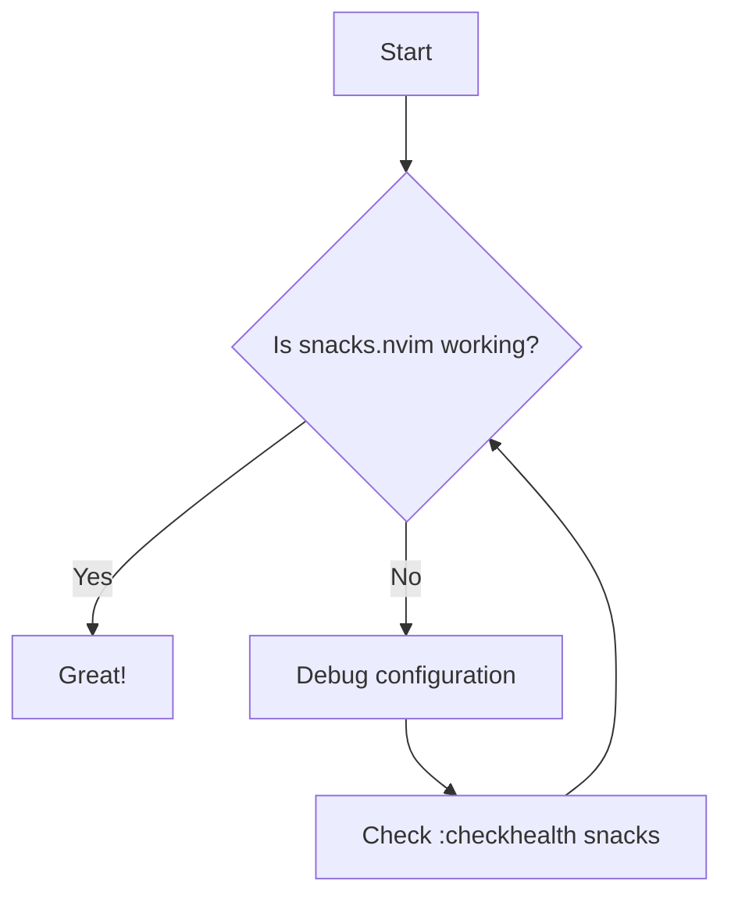
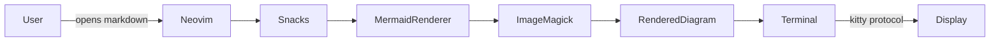
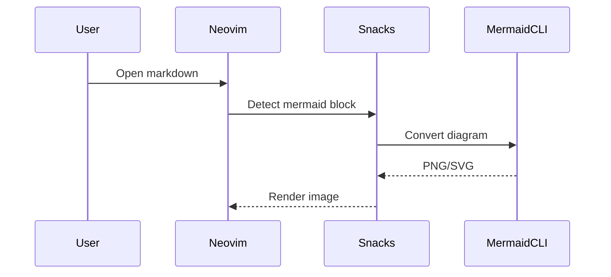
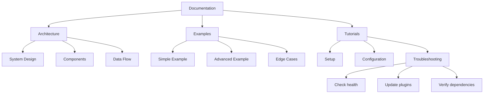

# Mermaid Rendering Test

This file contains a few Mermaid diagrams of different sizes so you can test:

- inline rendering
- hover preview
- centered previews
- scrolling behavior

---

## 1. Simple Flowchart

Some text after the diagram so you can test leaving the block.

---

## 2. Slightly Larger Diagram

---

## 3. Sequence Diagram

---

## 4. Large Graph (good for testing centering)

---

## End

Move the cursor inside diagrams to test:

- `Snacks.image.hover()`
- auto-preview
- centered preview window
